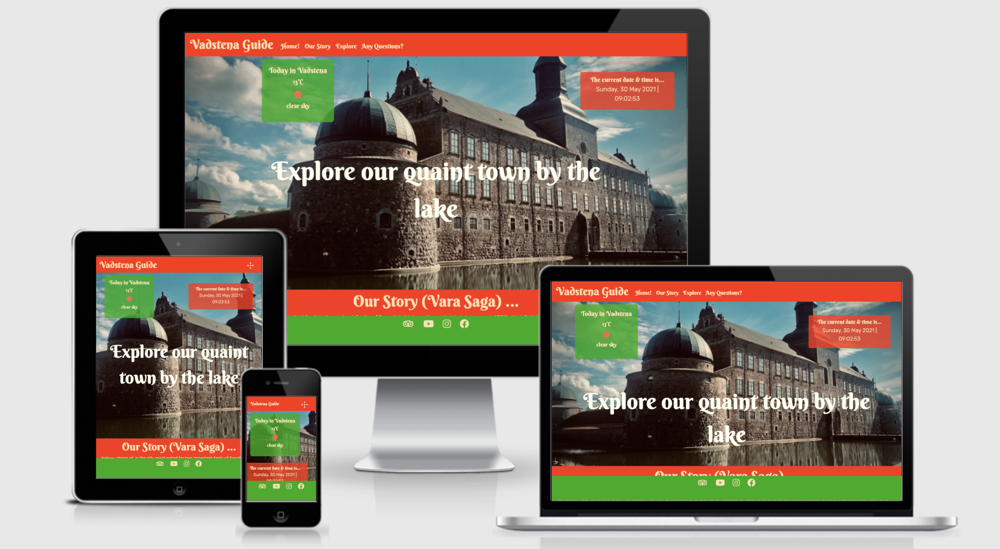
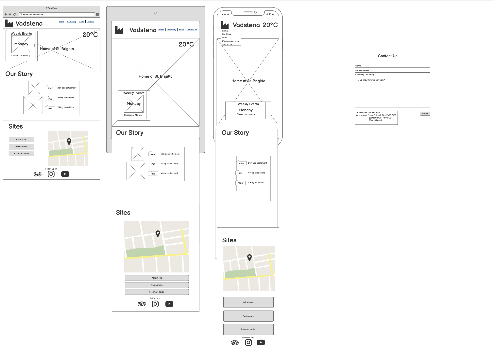

# Vadstena Guide

Welcome to Vadstena Guide! This is a small interactive website, suited more for the person who is travelling to Vadstena and would like a quick look at the tourism of the town. The idea is for it to look like a traditional guide book like "Frommers" etc. 
It is google map capable, with the current time and weather. Users can also send an email to the bureau if they are lost or would like any information.

**[View the live project here.](https://dsteyn44.github.io/vadstena-ms2/)

## UX
 
### Strategy:

 Target market: Aiming for the all travellers despite age that is the reason for the bold colors. Usually this is B2B but I have gone with a B2C strategy as travellers want quick responses when visiting a place. 

#### First time User Stories
- As a user, I want to be able to access the website on a desktop but mainly mobile devices and tablets, so that I won't be restricted from which device I can access the site.
- As a user, I want to be able to follow or connect with the owner of the website on social media, so I can get more information about the town.
- As a user, I would like to know what the city has to offer, so that I can adjust it to my needs and interests.
- as a user I would like to get a better understanding of the towns history.
- As a user, I want to have an access to the map of the city with various places, so I can visually see their location.
- As a user, I want to be able to contact the site owner, so I will be able to share my feedback regarding the website or ask about planning my visit and get some more advice and recommendations.

#### Frequent User
- As a frequent user I want updates so that I can visit the website and it will keep me interested.

#### Toursit Representative 
- As a toursit representative I want a stand-out website so that users can easily navigate.
- As a toursit representative I want a travellers to be able to get hold of me via email.

#

### Features

#### Header
- The Town's Logo: Always on the left-hand side to get the users attention.
Navigation Bar: Too include links to Home button, OUr Story, Explore. It must also include a "Contact Us" link. A custom-styled (in this case I styled it to the unofficial logo of the town - five dots) hamburger styled toggle will be added for small screen sizes so that it will be easier to navigate.

#### The Footer 
- Links to social media platforms that are related to the product. Must be fixed and visible at all times so that the user can easily get to it. 

#### The Home Page 
- Should have the temperature and weather in a type-of widget form.
- Should have a background that has a hero shot of the castle.
- Should have a hero text that has a inviting statement ("Explore" in this case is a link too). 

#### Our Story Page
- Should have historical information. I tried a timeline and accordian in this case and it did not work.
- Should have historical figures. I did have a text overlay to explain which each person and image was unfortunately ran out of time to perfect it. 

#### Explore Page
- this is an interactive map with buttons you can click on to show you "Must See" sites, "Eat!" restaurants, "Stay" hotels, "Shop" where you can shop.
- There will be a marker to show you where Vadstena is in Sweden and when you click on it there is an info window inviting you to explore.
- Each of the buttons has markers showing an image of the site, as well as some info text.

#### Any Questions? (contact page)
- Basically an email portal to contact the tourist bureau.
- Users can send an email to the bureau with their email address.

## Features Left to Implement
- I orginally had a slider with a days of the week and in fact it worked rather well. It scroll X, which I know is not good for UI  and hence i disposed of it but wit would have been a good feature to add.
- Also would likew to make the history page nore interactive with a time line etc.

## Structure:
- The structure is just a single scroll page with links to the various "pages". 
- A basic single path with no branches to make it as simple as possible.
#

## Skeleton
The wireframes were designed using [Balsamiq](https://balsamiq.com/). 

#

## Surface
- Mainly I wanted to use bright colors to attract the attention of the traveller and make it fun. 

#### Colours
- I used a variation of Red / Green/ Blue/ Yellow.

#### Typography
-  Berkshire Swash - this was used as the main themed font.
- Rubik was used as my secondary font.  

#### Images
- The images I used were either png. and some jpg. But this time I experimented with "svg"’s. The "svg"’s were a little tough to use in googlemaps andin the javascript files, although they did render a better crisp image. 
- Therefore for the markers PNG´s were used because they had less 

## Technologies Used

- [HTML 5](https://en.wikipedia.org/wiki/HTML5) - Standard programing language.
- [CSS 3](https://en.wikipedia.org/wiki/Cascading_Style_Sheets) - Standard programing language.
- [BOOTSTRAP 4.1.3](https//bootstrrap.com)- Bootstrap is the most popular HTML, CSS, and JavaScript framework for developing responsive, mobile-first websites. This was used extenssively throughout the project for example the grid layout , navbar structures, dropdown menus, jumbotrons, modals, and dispay (media).
- [JAVASCRIPT](https://en.wikipedia.org/wiki/JavaScript) - Programming language that conforms to the ECMAScript specification. This was used for the modals in conjuction with Bootstrap.
- [GOOGLE FONTS](https://fonts.google.com/) - I added this the font that i used through out
- [FONT AWESOME](https://fontawesome.com/) - I used this for all my icons eg: social links etc. 
- [AFFINITY PHOTO](https://affinity.serif.com/en-us/) - This a helped me so some mock-ips and for the background images on the fail page.
- [GITHUB](https://gitpod.io/) - IDE (Integrated Development Environment).
- [GITPOD](github.com/) - The remote hosting platform.
- [MOUNTAIN GOAT](https://www.mountaingoatsoftware.com/) - This was used to understand user stories.
- PAGES - Apple generic word processing program/application.  
- [W3 SCHOOLS](https://www.w3schools.com/) - I Found this very useful for clarification of clearfix  and inline block. 
- [STACK OVERFLOW](https://stackoverflow.com/) - It is gennerally public platform, mainly used for coming up with scripte solutions. 
- [MDZN](https://developer.mozilla.org/) - Resource tool for developers, by developers. I used this to assist with resizing my images.
- [CHROME DEVELOPER TOOLS](https://developers.google.com/web/tools/chrome-devtools) - This was used to test out resposnsiveness and just for general trouble-shooting. Gives you real time feedback.
- [RESPONSIVE WEB DESIGN](http://ami.responsivedesign.is/) - I used this to add to my mock-up for my README.md.

#

## Testing

View the testing [here](testing.md).

#
## Deployment

### This project is hosted in GitHub Pages

- On the menu on the top of the project’s repository on GitHub select Settings.
- Scroll down to the GitHub Pages section.
- Inside that section, click on the drop-down menu under Source and select Master Branch.
- The page refreshes automatically and the website is now deployed.
- The link to the webpage is just in the GitHub Pages section down below.
- Only one branch has been used for this project.

### To clone this project from GitHub:

- Under the repository’s name, click Clone or download.
- In the Clone with hTTPS section, copy the given URL.
- In your IDE of choice, open Git Bash.
- Change the current working directory to the location where you want the cloned directory to be made.
- Type git clone, and then paste the URL copied from GitHub.
- Press enter and the local clone will be created.

### Google maps:
See maps.js

### Email.js:

Setting up EmailJS account ** Note that Email JS is different than the version on the Code institutes Video.

first go to EmailJS.com and register for a free account.
Go to “Add New Service” and click. 
Choose an account. I have a Gmail account so I chose that. 
Click on Connect Account.
A OAuth verification will come to say what EmailJS is allowing you to do.
Check on the box to send a test email. 
And you should recieve an email in your email account - in this case it is my Gmail account.  
Now we need to make an email template.
Go back into EmailJS.com and click on Email Template.
Choose a blank template.
A default email template comes up.
Go to setting to type template name- you will see your template ID comes up automatically.
Then click back to “content” and under “Subject” place the subject for each email we receive. In this case it will be “Can you you help Me?”
Then we will place where the email will be sent to - in this case my email address in Gmail.
Uncheck the “Use Default Email Address” box.
(actually it will not allow you to uncheck the “Use Default Email Address” box before saving and thus sending a test email - which needs to be done next.
That is as far was go now.
We will then send a test email.
And Viola- it arrive an email from me in my Gmail account.

No we are going to add the Software development kit That EmailJS provides to connect to our index.html.
When we go back to the EmailJS webpage we see some Javascript code
emailjs.send(“service_j32l2w9”,”template_o51c1wr”);*** But actually this is not the same as the code in the video. That code you can get at SDK> emails.send

When we close the window down we will see that our Template name - in this case “Dan” is up ate the top.

Now go to Documentation at the top on the page.

Then on the side bar go down to SDK installation. Below is what you will see. (Not that in the video it says Javascript Library and in the real life it says SDK)
You will need to paste this code before the closing </head> tag.
Then we need to get our user ID which by noting is to click on the integration page.
See where it says user ID - copy and paste that in the script above where it says “YOUR_USER_ID”. Note to click on the tags.
Now we add the code below that we found before .
   emailjs.send('YOUR_SERVICE_ID', 'YOUR_TEMPLATE_ID', templateParams)
Note again thesis not like the video.

Now we add the code to under the emailjs.init. code in the <script> element in your index.html file.
Then you add the service code ie: service_j32l2w9 ( you received earlier and your) and your template ID (Dan in this case).
We can also add the project information after { name: ‘Daniel’ notes: ‘The information I want is…’} * note best to use apostrophes instead of “. 
Now though, we want to edit our email template so that we can pass in parameters and have some content in the email that's provided.
Now we have to passion some variables in to our form.
Go to To Email on the left hand side of your email template and write in {{from_email}}
then go to content and add “{{tourist_help}} - these are placeholder names.
Then save and go to test it and when you write under the Template Parameters you will see the {{from_email}} As below.

Fill in the information and send and you will receive an email result.
Now we will hook up our project with this.
We now go to the top of our index.html.

we will scroll down past the <footer> tag and paste this. 
Add <script src=“./assets/js/sendmail.js.”><script>
Create a sendmail.js file in your repo. then go into this enter console.log(“Hello”);
Refresh your browser and inspect the console - it should say “Hello” if connected.
then go into sendmail.js and add the following

#

## Credits

### Content
- Most of the content I got I sourced from the band's Facebook Page.
- The rest of the written content I made up. 

### Media
- Images used in this site were obtained from either google or from the groups's page on facebook. I then modified some images in Affinity.
- Some of the links point to [Wikipedia](https://en.wikipedia.org/wiki/King_of_Asgard).

### Acknowledgments
- Kloster Hotellet in Vadsteana
- Precious Ijege for the mentor guidance and support.
- The Code Institute tutor team, and specially Jo, for their help and patience.
- My wife Sofia and children August and Adam.
#