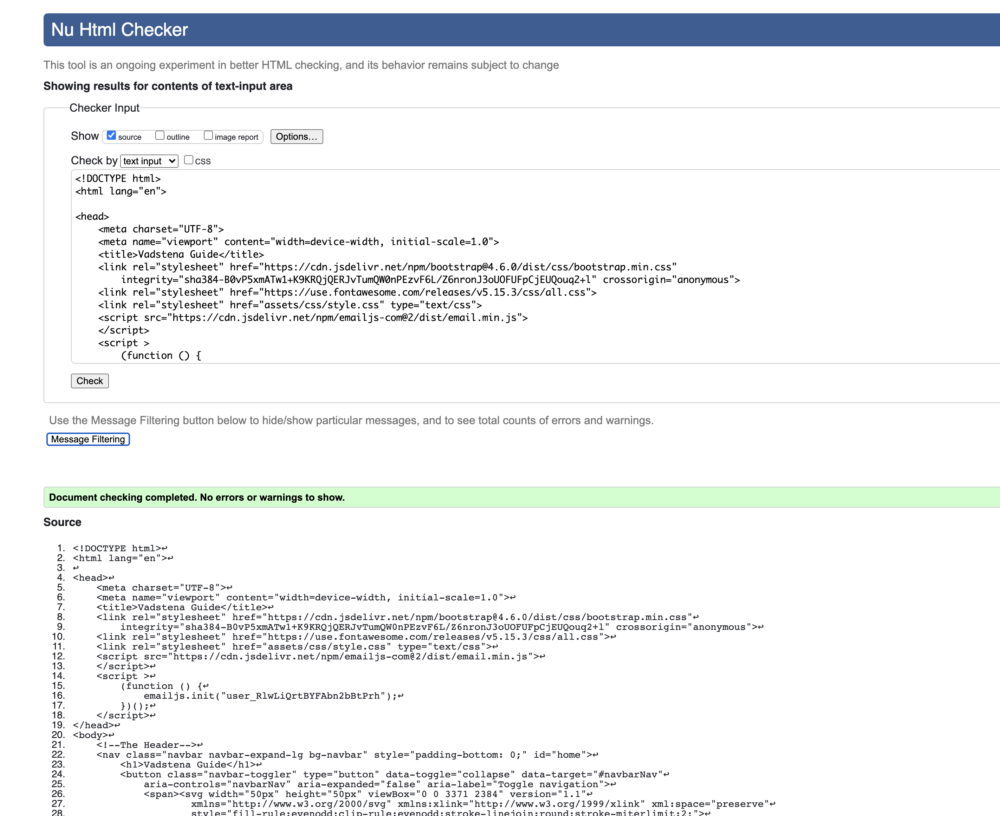
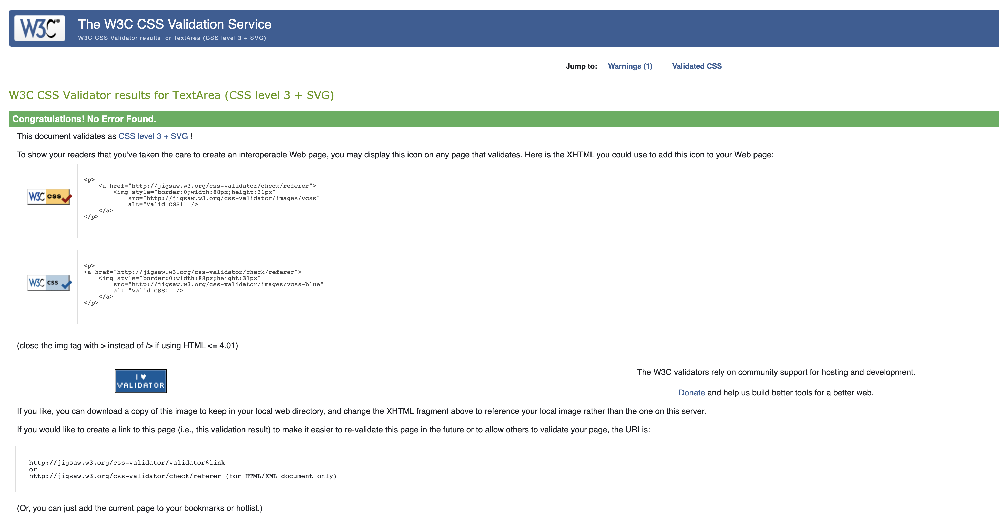

#  Testing Ground

## Overview  

#
## Validators used: 
- Jigsaw - I used this for CSS verification. [Jigsaw validator](https://jigsaw.w3.org/).
- Nu W3 validator - I used this for HTML verification. [W3 validator](https://validator.w3.org/).

### Proof of final validation:

### HTML:
#### index.html 

### CSS:
#### style.css

## Email.js:
#### style.css

#
## Responsiveness

For the responsiveness I used Chrome Developer Tools to check how the website would behave. However saying this I must add that it did not always give a correct or real account on the device. Of course it is only a tool and not but I found one instance where it did not give me the correct response. This was an instance it was for mobile phone (iPhone X). Unfortunately I had some issues with the response for the time and weather icons

I also used [Responsive Design Checker](www.responsivedesignchecker.com) and this was fairly accurate. The difference (niether good nor bad) this site has over Chrome Devoloper is that it has some sizes that Chrome does not such as the IMac Desktop 24". I us the 27" so when I opened my browser to Chrome it overstretched my image. Below is a responsiveness chart that shows the how each device responded. I added the surface duo because it has a perculiar screen so i can see how my site reacts. 

### Chrome

### Mozilla Firefox

### IOS Mac

#
## Bugs

# Bugs:
- script.js and slider.js <script> would not load in index.html.
Action: it was the incorrect path in the script. works now.

#Bugs:
dots.svg, when opened in github would error
Action: I had to remove some of the code in the <svg> to make allow it to be accepted.
The dots.svg would not change color when I added it to HTML as an image so I copied the sag code and added it directly into the  that I used to hold the hamburger toggle icon. Here I was able to manipulate the <svg> to the ivory I wanted to use. 
Action:
Slider Bug - when I added the slider it disappears when you respond vertically.
## User stories

## Side Notes

### - These are a few of my notes that i took while coding. I ran a little out of time near the end so some do not reflext the final changes. 
[Side Notes](readme-files/ms-1-list.pdf) [original front page]